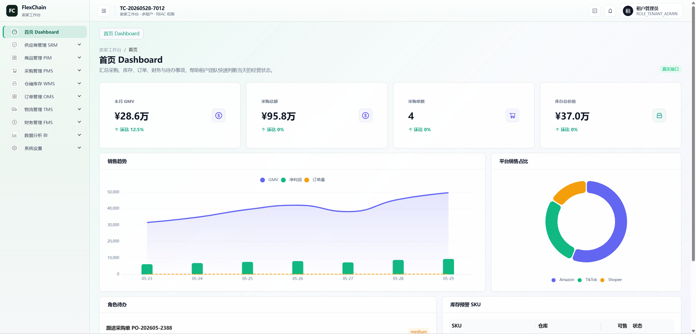

# FlexChain ????? SaaS ??

FlexChain ??????????????? SaaS ????????? Spring Cloud ??????????????????????????????????????????????? BI ?????

???????? CRUD ?????????????????????????????????????Feign???????RBAC ??????????????????

## ????

????? `supplychain-10-web`?????????????????

### ?? Dashboard



### ?????


## ????

- ?????????????????????????
- RBAC ??????????????????????????????
- PIM ?????SPU/SKU??????????????????
- SRM ????????????????????????????
- PMS ????????????????????????????
- WMS ????????????????????????????
- OMS ???????????????????????????
- TMS ??????????????????????????
- FMS ???????????????????????????
- BI ???????????????KPI ??????????

## ???

- Java 17
- Spring Boot
- Spring Cloud Alibaba
- Spring Cloud Gateway
- Nacos
- MyBatis-Plus
- Sa-Token
- OpenFeign
- MySQL 8
- Redis
- Maven ???
- XXL-JOB

## ????

| ?? | ?? |
| --- | --- |
| `supplychain-gateway` | ?? API ????????????? |
| `supplychain-system` | ?????????????????????? |
| `supplychain-product` | ?? SPU/SKU???????????? |
| `supplychain-supplier` | ???????????????? |
| `supplychain-purchase` | ???????????????????? |
| `supplychain-warehouse` | ????????????????? |
| `supplychain-order` | ????????????????? |
| `supplychain-logistics` | ??????????????? |
| `supplychain-finance` | ????????????????? |
| `supplychain-common` | ?????Feign ???????????????? |

## ????

```text
.
|-- nacos-config/              Nacos ????
|-- sql/                       ????????????
|-- docs/                      ???????
|-- supplychain-common/        ??????
|-- supplychain-gateway/       API ??
|-- supplychain-system/        ??? RBAC ??
|-- supplychain-product/       ????
|-- supplychain-supplier/      ?????
|-- supplychain-purchase/      ????
|-- supplychain-warehouse/     ????
|-- supplychain-order/         ????
|-- supplychain-logistics/     ????
|-- supplychain-finance/       ??? BI ??
`-- xxl-job-3.4.0/             XXL-JOB ???????
```

## ??????

### ????

- JDK 17+
- Maven 3.8+
- MySQL 8+
- Redis
- Nacos

### ??

```powershell
mvn clean package -DskipTests
```

????????

```powershell
mvn -pl supplychain-system -am -DskipTests compile
mvn -pl supplychain-purchase,supplychain-warehouse,supplychain-finance -am -DskipTests compile
```

## SQL ????

????????????????????? `sql` ?????????????

```sql
source sql/00_full_schema.sql;
source sql/01_demo_seed.sql;
```

?????

1. `sql/00_full_schema.sql`
   - ??????? `supplychain_dev` ??????
   - ?? 81 ????/??????
   - ??? `supplychain_dev` ????
   - ?? `DROP TABLE IF EXISTS`??????????????????

2. `sql/01_demo_seed.sql`
   - ??????? `supplychain_dev` ??????
   - ??????????????
   - ?????????????????????????TMS ????????????

?????

1. ??????? MySQL ???
2. ?? `sql/00_full_schema.sql`?
3. ?? `sql/01_demo_seed.sql`?
4. ?? Nacos ? MySQL?Redis?????????
5. ???????
6. ???????????????

???? SQL ????????????????????????????????????? `15_mvp_demo_data.sql`?`15_mvp_demo_data_clean.sql`?`15_mvp_demo_data_repair.sql` ???????

XXL-JOB ??????? `xxl_job`??????? XXL-JOB ???????????

```text
xxl-job-3.4.0/doc/db/tables_xxl_job.sql
```

## ????

Nacos ?????? `nacos-config/`??????????

- MySQL ?????????????
- Redis ??????
- Nacos ????????
- ????????
- Sa-Token????????????

## ????

?????????

```powershell
mvn -pl supplychain-finance -am -DskipTests compile
mvn -pl supplychain-product -Dtest=ProductSpuServiceImplTest test
```

????????????????????????????????

```powershell
npm run audit:db
npm run audit:rbac
npm run audit:chain
npm run audit:purchase-chain
```

## ????

- ??????????????? code???????????
- ????????????? Integer ?????
- ?? mock ????????????
- ???????????????????????????
- ????????? API ???????????
- ???????????????????????????????

## ??

????????????? token ???
